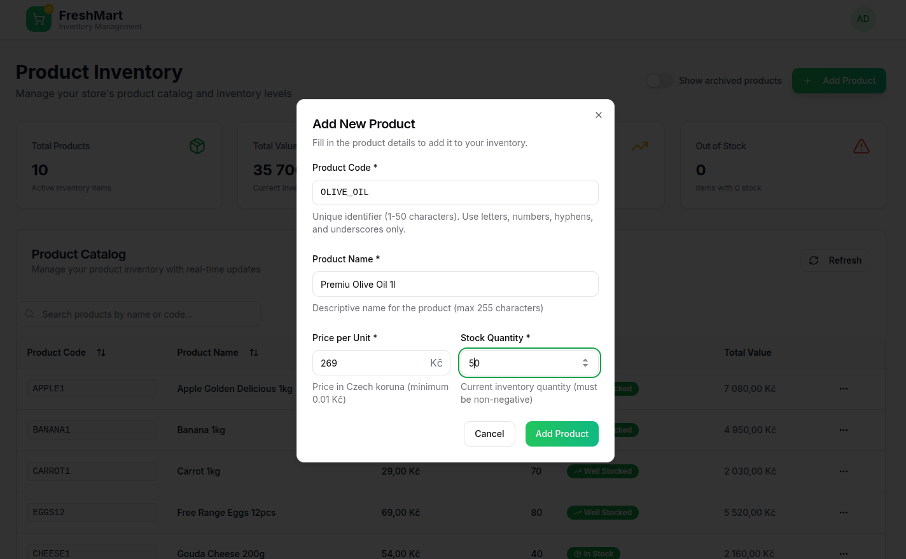

# FreshMart - Grocery Management System

A modern, production-ready React application for managing grocery store inventory with real-time updates and a beautiful UI.





## 🎯 Features

- **🔐 Authentication**: Basic Auth with session management
- **📊 Real-time Dashboard**: Live inventory with auto-refresh
- **🛍️ Complete CRUD**: Create, Read, Update, Delete products
- **🎨 Modern Design**: Fresh grocery-themed UI with Tailwind CSS
- **⚡ Live Updates**: Real-time table updates without page refresh
- **📱 Responsive**: Works on all screen sizes
- **🔍 Smart Search**: Search products by name or code
- **📈 Analytics**: Stock alerts and inventory statistics

## 🛠️ Technologies Used

- **Frontend**: React 18 + TypeScript + Vite
- **Styling**: Tailwind CSS + shadcn/ui components
- **State Management**: React Query + React Context
- **Routing**: React Router 6
- **Forms**: React Hook Form + Zod validation
- **Icons**: Lucide React
- **API**: RESTful integration with SpringBoot backend

## 🚀 Quick Start

### Prerequisites

- Node.js 18+ and npm
- Your SpringBoot API running on `http://localhost:8080`

### Installation

1. **Clone/Download this project**
2. **Install dependencies:**

   ```bash
   npm install
   ```

3. **Configure API (if needed):**

   - Create `.env` file in root directory:

   ```bash
   VITE_API_BASE_URL=http://localhost:8080
   ```

4. **Start development server:**

   ```bash
   npm run dev
   ```

5. **Open your browser:**
   - Navigate to `http://localhost:5173`
   - Login with your SpringBoot Basic Auth credentials
   - Default demo: `admin / admin`

## 📁 Project Structure

```
freshmart/
├── src/
│   ├── components/          # Reusable UI components
│   │   ├── auth/           # Authentication components
│   │   ├── layout/         # Layout components (Header, etc.)
│   │   ├── products/       # Product management components
│   │   └── ui/             # shadcn/ui components
│   ├── hooks/              # Custom React hooks
│   ├── lib/                # Utilities and API client
│   ├── pages/              # Page components
│   ├── types/              # TypeScript type definitions
│   └── index.css           # Global styles
├── public/                 # Static assets
└── package.json           # Dependencies and scripts
```

## 🔧 Available Scripts

- `npm run dev` - Start development server
- `npm run build` - Build for production
- `npm run test` - Run tests
- `npm run typecheck` - Type checking
- `npm run format.fix` - Format code with Prettier

## 🔌 API Integration

This application is designed to work with your SpringBoot API using the following endpoints:

### Products API

- `GET /api/v1/products?onlyActive=true` - Get all products
- `GET /api/v1/products/{code}` - Get product by code
- `POST /api/v1/products` - Create new product
- `PUT /api/v1/products/{code}` - Update product
- `DELETE /api/v1/products/{code}` - Delete product

### Authentication

- Uses HTTP Basic Authentication
- Credentials sent with each API request
- Session managed in localStorage

### Expected Product Data Structure

```typescript
interface Product {
  code: string; // Unique product identifier
  name: string; // Product name (max 255 chars)
  stockQuantity: number; // Current stock (≥ 0)
  pricePerUnit: number; // Price in CZK (≥ 0.01)
}
```

## 🎨 Customization

### Colors & Branding

- Edit `tailwind.config.ts` to change color scheme
- Update `src/index.css` for CSS variables
- Modify logo/branding in `src/components/auth/LoginForm.tsx`

### API Configuration

- Update `src/lib/api.ts` for different API endpoints
- Modify `src/types/product.ts` for different data structures

### Features

- Add new pages in `src/pages/`
- Create new components in `src/components/`
- Extend API client in `src/lib/api.ts`

## 🚀 Production Deployment

1. **Build the application:**

   ```bash
   npm run build
   ```

2. **Deploy the `dist` folder** to your web server

3. **Configure environment variables** for production API URL

4. **Set up reverse proxy** (nginx/Apache) if needed

## 🐛 Troubleshooting

### Common Issues

1. **API Connection Issues**

   - Check if SpringBoot API is running on correct port
   - Verify CORS settings in your SpringBoot configuration
   - Check network/firewall settings

2. **Authentication Problems**

   - Verify Basic Auth credentials
   - Check SpringBoot security configuration
   - Clear localStorage: `localStorage.clear()`

3. **Build Issues**
   - Clear node_modules: `rm -rf node_modules && npm install`
   - Clear Vite cache: `rm -rf node_modules/.vite`

### Environment Variables

Create `.env` file for custom configuration:

```bash
VITE_API_BASE_URL=http://your-api-server:8080
VITE_APP_TITLE=Your Store Name
```

## 📦 Dependencies

### Core Dependencies

- React 18.3.1
- TypeScript 5.5.3
- Vite 6.2.2
- React Router 6.26.2
- React Query 5.56.2
- React Hook Form 7.53.0
- Tailwind CSS 3.4.11

### UI Components

- Radix UI (complete component library)
- Lucide React (icons)
- shadcn/ui (pre-built components)

## 🤝 Contributing

1. Fork the repository
2. Create feature branch: `git checkout -b feature/amazing-feature`
3. Commit changes: `git commit -m 'Add amazing feature'`
4. Push to branch: `git push origin feature/amazing-feature`
5. Open a Pull Request

## 📄 License

This project is licensed under the MIT License.

## 👨‍💻 Support

For support or questions:

- Check the troubleshooting section
- Review the API documentation
- Open an issue on the repository

---

Built with ❤️ using React, TypeScript, and Tailwind CSS
